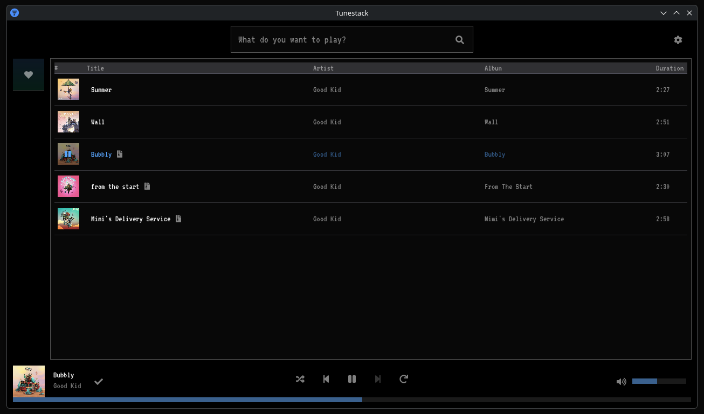

# tunestack

> **⚠️ Learning project — not intended for piracy or any commercial use.**
>
> tunestack streams audio by searching YouTube and downloading the result via yt-dlp. This is **not a viable tool for actually listening to music** — the free YouTube Data API v3 quota is capped at 100 units per day, which is roughly 10–15 searches before the key is exhausted. Beyond that it simply stops working. This project exists purely because I wanted to see if I could build it, and as something to show on a portfolio. Please don't use it to pirate music. Buy/stream music through legitimate services and support the artists you love.
>
> All code in this repository is free to use however you like — no strings attached.

---



---

## What it is

A desktop music client written in C++20. You type an artist or track name, it queries Last.fm for matching results, enriches each result with album art and duration in the background, then on click it searches YouTube for the audio, downloads it with yt-dlp, and plays it locally. A basic radio mode queues similar tracks automatically using Last.fm's similar-tracks API. Liked songs are stored in a local playlist that persists between sessions.

**Tech stack at a glance:**
- UI — Dear ImGui (SDL3 + SDL_Renderer backend)
- Audio — miniaudio
- Metadata — TagLib
- Networking — cpp-httplib + OpenSSL
- Data — nlohmann/json
- Track search/metadata — Last.fm API
- Audio source — YouTube Data API v3 + yt-dlp (auto-downloaded on first launch)

---

## Features

- Search tracks via Last.fm
- Background enrichment — album art and duration fetched per-result without blocking the UI
- Click to play — YouTube is searched, audio downloaded, and playback starts automatically
- Play queue — clicking a result in a playlist queues the remaining tracks and pre-fetches the next one
- Radio mode — when the queue empties, similar tracks are fetched from Last.fm and auto-queued
- Liked songs — heart any track to save it; persisted to a local JSON playlist
- Settings modal — configure your API keys and inspect/clear the download cache
- yt-dlp auto-download — the binary is fetched from the official GitHub release on first run; no manual setup needed
- YouTube rate-limit handling — 429 responses are surfaced to the user and retried automatically after 60 s

---

## Building

### Prerequisites

These must be installed on your system before building — they are **not** fetched by CMake:

| Dependency | Notes |
|---|---|
| [SDL3](https://github.com/libsdl-org/SDL) | Build from source or install via your package manager |
| OpenSSL | `libssl-dev` (apt) / `openssl` (brew) |
| CMake ≥ 4.0 | |
| A C++20 compiler | GCC 13+ or Clang 16+ recommended |

The following are fetched automatically by CMake's `FetchContent` at configure time:

| Library | Repo | Purpose |
|---|---|---|
| [Dear ImGui](https://github.com/ocornut/imgui) | ocornut/imgui | UI rendering |
| [stb](https://github.com/nothings/stb) | nothings/stb | Image loading (window icon, textures) |
| [TagLib](https://github.com/taglib/taglib) | taglib/taglib | Audio file metadata |

The following are bundled in `lib/` and need no setup:

| Library | Repo | Purpose |
|---|---|---|
| [cpp-httplib](https://github.com/yhirose/cpp-httplib) | yhirose/cpp-httplib | HTTP client |
| [nlohmann/json](https://github.com/nlohmann/json) | nlohmann/json | JSON parsing |
| [miniaudio](https://github.com/mackron/miniaudio) | mackron/miniaudio | Audio playback |
| [IconsFontAwesome5](https://github.com/juliettef/IconFontCppHeaders) | juliettef/IconFontCppHeaders | Icon font headers |

### Steps

```bash
git clone https://github.com/your-username/tunestack.git
cd tunestack
mkdir build && cd build
cmake ..
cmake --build . -j$(nproc)
./tunestack
```

Or use the provided build script from the project root:

```bash
./build.sh
```

### API keys

On first launch, open **Settings** and enter:

- **YouTube Data API v3 key** — [Google Cloud Console](https://console.cloud.google.com/). Enable the YouTube Data API v3 for your project.
- **Last.fm API key** — [Last.fm API account](https://www.last.fm/api/account/create). Free, instant.

Settings are written to a `settings.json` file in your platform config directory.

---

## A note on AI assistance

Some of the file scaffolding and boilerplate in this project (initial class skeletons, CMake setup, etc.) was written with the help of [Claude](https://claude.ai) to speed up development. All logic, architecture decisions, and feature work are my own.

---

## Licence

Do whatever you want with this code. No attribution required, though it's always appreciated.

---

[](https://buymeacoffee.com/ratprez)
